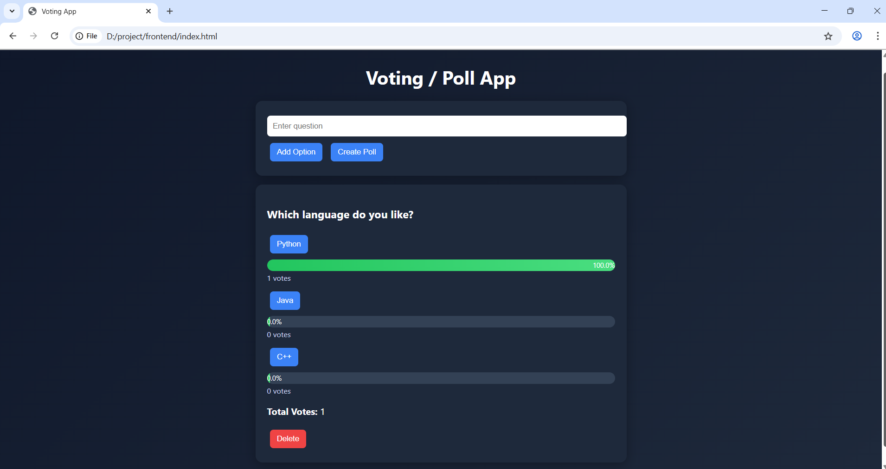

# Polling App

A full-stack voting/poll application built using FastAPI (Python) and JavaScript. Users can create polls, vote on options, and view real-time results with percentage-based progress bars.

---

## Output



## Features

- Create polls with 2–4 options  
- Vote on polls  
- Real-time results with percentages  
- Progress bar visualization  
- Prevent duplicate voting (IP + localStorage)  
- Delete polls  
- View all polls  

---

## Tech Stack

- Backend: FastAPI (Python)  
- Frontend: HTML, CSS, JavaScript  
- Database: In-memory storage  

---

## API Endpoints

- GET /polls  
- POST /polls  
- POST /polls/{id}/vote  
- DELETE /polls/{id}  
- GET /polls/{id}/results  

---

## Project Structure

```
project/
├── frontend/
│   ├── index.html
│   ├── style.css
│   └── app.js
└── backend/
    └── main.py
```

---

## How to Run

### Backend

```
cd backend
pip install fastapi uvicorn
uvicorn main:app --reload
```

### Frontend

Open `frontend/index.html` in your browser  

---

## Author

Pranay Pilli
